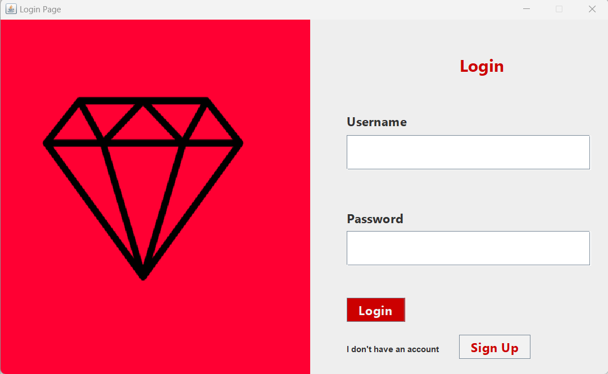
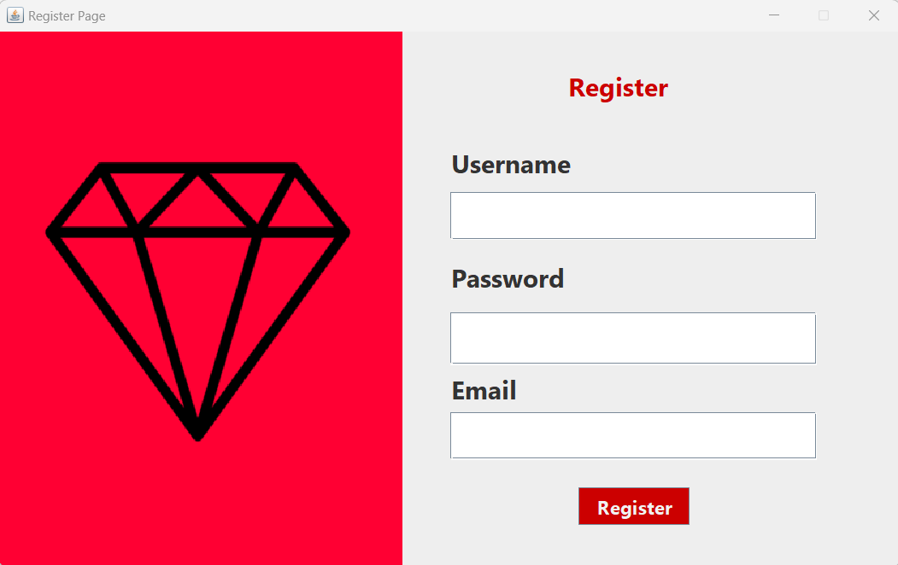

# LoginPageJava
<table>
  <tr>
    <td></td>
    <td></td>
  </tr>
</table>

<!-- Projeye ait bir ekran görüntüsü veya logo -->

Bu gitHub reposu, temel bir giriş sayfası (login page) örneğini içermektedir. JAVA,SWING,MYSQL kullanarak oluşturulmuştur.Kullanıcıların basitçe giriş yapabileceği bir arayüz tasarımını içermektedir.Giriş işleminin yapılabilmesi için kayıt olunması gerekmektedir.Giriş yapılmaz ise program şifre ya da kullanıcı adı yanlış hatası vermektedir.

## Özellikler

- Kullanıcı girişi yapılabilen bir giriş sayfası.
- Kullanıcı kaydı yapılabilen bir giriş sayfası.
- Veritabanı ile iletişim kurmak için JDBC ve MySQL kullanımı.

## Gereksinimler

- Java JDK (örneğin, Java 8 veya üstü)
- MySQL veritabanı
- Swing GUI kütüphanesi
- NetBeans(IDE)

## Kurulum

1. Veritabanını oluşturmak için `login.sql` dosyasını MySQL veritabanınıza içe aktarın.
2. Proje klasöründeki `src` dizinine gidin.
3. Terminal veya Komut İstemi'ni açın ve komutları çalıştırın:

## Katkıda Bulunma

1. Bu repoyu "Fork" edin.
2. Yeni bir branch oluşturun (`git checkout -b yeni-ozellik`)
3. Değişikliklerinizi yapın ve bunları commit edin (`git commit -am 'Yeni özellik eklendi'`)
4. Dalınızı main'e pushlayın (`git push origin yeni-ozellik`)
5. Bir Pull Request oluşturun.

## Lisans

Bu proje MIT Lisansı altında lisanslanmıştır. Daha fazla bilgi için [LICENSE](LICENSE) dosyasını inceleyin.

---

